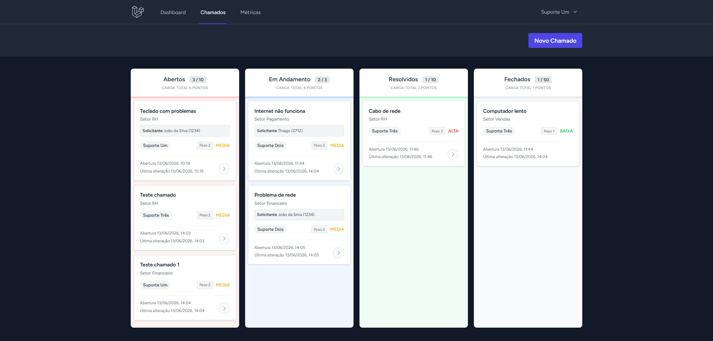

# **Sistema de Controle de Chamados Internos**

Sistema criado como parte do teste da empresa **Codificar**.

---

## **Sobre o Projeto**

Este projeto é um sistema para organização de demandas (chamados) desenvolvido em Laravel. As funcionalidades consolidadas incluem as seguintes entregas técnicas.



* **Acesso e Segurança** Portal público para abertura de chamados sem cadastro e ambiente restrito para a equipe técnica com navegação protegida.
* **Gestão Visual Kanban** Quadro interativo com limites de WIP, exibição de datas, dados do solicitante e painel de Dashboard pessoal.
* **Automação de Fluxo** Distribuição inteligente de tarefas e bloqueio ativo de sobrecarga utilizando um sistema de pesos.
* **Controle de Prazos** Escalonamento automático de prioridades com alertas visuais baseados no tempo de atraso dos chamados.
* **Métricas Ágeis** Tela dedicada para monitoramento avançado de desempenho com Lead Time, Cycle Time, Throughput e estatísticas individuais.
* **Ciclo de Vida Seguro** Gerenciamento completo de edições, atualizações de status e bloqueio de exclusões acidentais mediante confirmação flutuante.
* **Limites de WIP Ativos** As colunas iniciais de chamados possuem tetos numéricos para evidenciar gargalos estruturais e impedir a sobrecarga de demandas pendentes com a equipe.
* **Trava Visual de Fechados** A coluna de conclusão apresenta um limite configurado em 50 cartões com finalidade puramente estética e de usabilidade. Essa numeração serve para indicar o acúmulo visual de elementos finalizados na tela, o que sinaliza o momento ideal para utilizar a rotina de exportação e limpeza em lote.

## **Requisitos**

Garanta a instalação dos seguintes componentes no seu ambiente local.

* **PHP** >= 8.5 ([Download PHP](https://www.php.net/))
* **Composer** ([Download Composer](https://getcomposer.org/))
* **Node.js** ([Download Node.js](https://nodejs.org/pt))
* **SQLite** (padrão da aplicação)

---

## **Instalação**

Siga os passos abaixo para configurar e executar o projeto localmente.

---

### **Passo 1: Clonar o Repositório**

No terminal, execute:

```bash
git clone https://github.com/matbeavis/sistema-chamados.git
```

```bash
cd sistema-chamados
```

---

### **Passo 2: Instalar Dependências do PHP**

No diretório do projeto, instale as dependências do Laravel:

```bash
composer install
```

>⚠️ Aviso de Ambiente: O funcionamento correto do Laravel e do Composer depende de extensões ativas na configuração local do PHP. Caso ocorram falhas durante a instalação dos pacotes ou na execução do servidor, verifique o seu arquivo php.ini. Confirme a liberação de ferramentas essenciais removendo o ponto e vírgula inicial de opções como zip, fileinfo, mbstring, curl, openssl e do driver do banco de dados correspondente.

---

### **Passo 3: Instalar Dependências do Node.js**

Instale as dependências do frontend:

```bash
npm install
```

---

### **Passo 4: Configurar o Arquivo `.env`**

Crie uma cópia do arquivo `.env.example` e ajuste as variáveis conforme necessário (banco de dados, chave da aplicação, etc.):

```bash
copy .env.example .env
```

---

### **Passo 5: Gerar a Chave da Aplicação**

Gere a chave única da aplicação:

```bash
php artisan key:generate
```

---

### **Passo 6: Executar Migrações**

Crie as tabelas no banco de dados e preencha dados iniciais:

```bash
php artisan migrate --seed
```

---

### **Passo 7: Compilar os Assets Frontend**

Compile os arquivos CSS/JavaScript para desenvolvimento:

```bash
npm run dev
```

Ou para produção, use:

```bash
npm run build
```

---

### **Passo 8: Iniciar o Servidor**

No terminal, execute:

```bash
php artisan serve
```

---

### **Passo 9: Iniciar o Agendador de Tarefas (Cron)**

O sistema de escalonamento automático de prioridades por atraso exige a execução contínua do verificador de rotinas. Abra um terceiro terminal na pasta do projeto e mantenha o comando abaixo operando de forma ininterrupta.

```bash
php artisan schedule:work
```

---

### **Passo 10: Abrir a Aplicação e Fazer Login**

A aplicação administrativa estará disponível em [http://127.0.0.1:8000](http://127.0.0.1:8000).
O portal público de criação de chamados pode ser acessado em http://127.0.0.1:8000/abrir-chamado.

### **Credenciais de Acesso Disponíveis**
```bash
suporte1@empresa.com | senha123;
suporte2@empresa.com | senha123;
suporte3@empresa.com | senha123;
```

---

## **Suporte**

Se você encontrar problemas entre em contato pelo [GitHub Issues](https://github.com/matbeavis/sistema-chamados/issues).